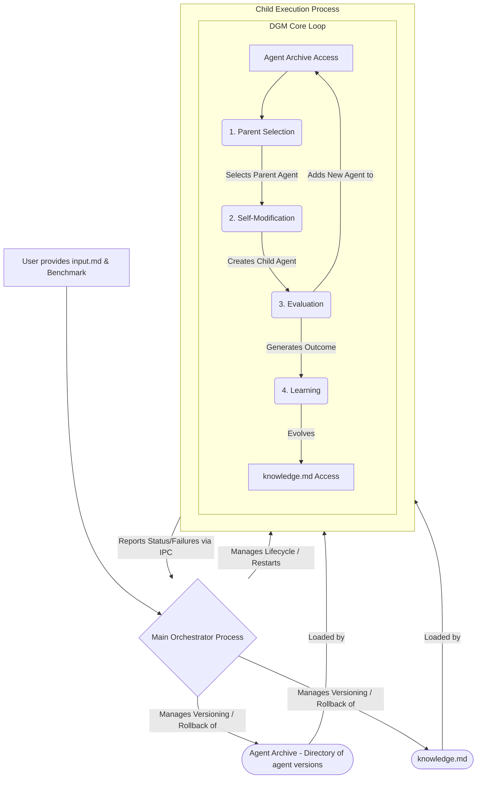

# Technical Product Requirements Document (PRD)
# Darwin Gödel Machine: An Adaptive Multi-Agent System

## Document Information
- **Version:** 4.0 (DGM Paradigm)
- **Date:** July 22, 2025
- **Author:** Roo

## Table of Contents
1. [Introduction](#1-introduction)
    1.1 [Purpose](#11-purpose)
    1.2 [Background](#12-background)
    1.3 [Scope](#13-scope)
    1.4 [Goals](#14-goals)
2. [System Architecture](#2-system-architecture)
    2.1 [High-Level Architecture](#21-high-level-architecture)
    2.2 [Key Components](#22-key-components)
    2.3 [DGM Evolutionary Workflow](#23-dgm-evolutionary-workflow)
3. [Agent Components](#3-agent-components)
    3.1 [PlannerAgent (Evolutionary Architect)](#31-planneragent-evolutionary-architect)
    3.2 [ExecutorAgent (Coding Agent)](#32-executoragent-coding-agent)
    3.3 [LearningAgent (Strategic Role)](#33-learningagent-strategic-role)
4. [Implementation Guide](#4-implementation-guide)
    4.1 [Main Orchestrator Process Responsibilities](#41-main-orchestrator-process-responsibilities)
    4.2 [Child Process Management and ADK Integration](#42-child-process-management-and-adk-integration)
    4.3 [Agent Code and Inlined Prompt Management](#43-agent-code-and-inlined-prompt-management)
    4.4 [System State Snapshot, Rollback, and Failure Recovery](#44-system-state-snapshot-rollback-and-failure-recovery)
    4.5 [Configuration Management (.env)](#45-configuration-management-env)
    4.6 [API Usage Management](#46-api-usage-management)
    4.7 [ADK Session State Considerations](#47-adk-session-state-considerations)
    4.8 [Agent Archive Management](#48-agent-archive-management)
    4.9 [Parent Selection and Evaluation](#49-parent-selection-and-evaluation)
5. [Knowledge Management (knowledge.md)](#5-knowledge-management-knowledgemd)
    5.1 [Dynamic Structure and Evolution](#51-dynamic-structure-and-evolution)
    5.2 [LearningAgent's Role in Updating knowledge.md](#52-learningagents-role-in-updating-knowledgemd)
6. [Operational Considerations](#6-operational-considerations)
7. [User Interaction Model](#7-user-interaction-model)

## 1. Introduction

### 1.1 Purpose
This technical PRD outlines the architecture for a self-evolving multi-agent system, inspired by the **Darwin Gödel Machine (DGM)**, designed to achieve user-defined objectives. The system will leverage open-ended evolution to continuously discover and archive a diverse population of increasingly capable agents, moving beyond a linear self-improvement loop.

### 1.2 Background
Traditional agent systems rely on fixed logic. This system adopts an agile, evolutionary approach where a population of ADK agents is iteratively improved. Drawing from the DGM paradigm, the system will not just modify a single agent but will select from an archive of diverse agents, fostering open-ended exploration and avoiding local optima. This allows for the discovery of novel agent designs and strategies.

### 1.3 Scope
This PRD covers the DGM-based architecture, including the Agent Archive, the evolutionary workflow, and the redefined roles of the system's agents. It details the mechanisms for agent self-modification, evaluation, and the strategic evolution of the system's knowledge base.

### 1.4 Goals
- Create a DGM-inspired multi-agent system capable of achieving diverse objectives from [`input.md`](input.md).
- Implement a DGM-inspired evolutionary loop where agents are selected from an archive, self-modify to produce new variants, are empirically evaluated, and then added back to the archive, fostering a growing population of diverse and capable agents.
- Enable agents to perform self-referential modification of their own source code ([`system_agents.py`](system_agents.py)), where improvements in coding directly enhance the ability to self-improve.
- Establish an 'Agent Archive' to store all viable agent variants, serving as a repository of stepping-stones for future evolution and enabling open-ended exploration.
- Implement a parent selection mechanism that balances exploitation (selecting high-performing agents) and exploration (selecting novel or less-explored agents) to guide the evolutionary process.
- Develop a dynamic [`knowledge.md`](knowledge.md) base, autonomously evolved by the `LearningAgent`, to capture the system's "evolutionary theory" and guide its development.

## 2. System Architecture

### 2.1 High-Level Architecture
The system architecture is inspired by the Darwin Gödel Machine (DGM), featuring a Main Orchestrator Process that manages a Child Execution Process. The Child Process runs the core DGM evolutionary loop. Instead of a fixed, linear sequence of agents, this loop facilitates an open-ended, population-based evolution of agents. It continuously selects agents from an "Agent Archive," prompts them to self-modify into new variants, evaluates these variants against a benchmark, and adds the successful ones back to the archive. This isolates the ADK environment and facilitates robust, evolutionary updates to the agent population.

### 2.2 Key Components
- **Main Orchestrator Process**: Manages the Child Process lifecycle, versions the entire **Agent Archive** and [`knowledge.md`](knowledge.md), handles code/prompt reloads by restarting the child, and initiates rollbacks on critical failures.
- **Child Execution Process**: An isolated process that initializes an ADK environment and runs the DGM evolutionary loop. This loop includes parent selection, self-modification, evaluation, and learning.
- **Agent Archive**: A version-controlled repository (e.g., a directory structure managed by Git) containing all viable, self-generated agent variants. Each variant is a complete, executable version of [`system_agents.py`](system_agents.py). This archive serves as the gene pool for the evolutionary process.
- **Agents**: `PlannerAgent`, `ExecutorAgent`, `LearningAgent` with redefined roles (see Section 3).
- **Knowledge & Inputs**: [`input.md`](input.md), [`knowledge.md`](knowledge.md), [`.env`](.env).

### 2.3 DGM Evolutionary Workflow
1.  **Initialization**: The Main Orchestrator starts the Child Process, which loads the agent population from the Agent Archive.
2.  **Parent Selection**: The system selects one or more "parent" agents from the archive based on a strategy in [`knowledge.md`](knowledge.md) that balances performance and novelty.
3.  **Self-Modification (Planner & Executor)**:
    a.  The `PlannerAgent` analyzes the selected parent and produces a high-level specification for a new feature or modification.
    b.  The `ExecutorAgent` receives this specification and implements the changes on the parent's source code, producing a new "child" agent.
4.  **Evaluation**: The new child agent is evaluated on a coding benchmark to get a fitness score. Only viable agents are kept.
5.  **Archive Update**: Viable child agents and their scores are added to the Agent Archive.
6.  **Learning**: The `LearningAgent` analyzes the entire archive for trends and updates [`knowledge.md`](knowledge.md) with strategic insights.
7.  **Loop**: The process returns to Step 2, creating a continuous cycle of evolution.

## 3. Agent Components

### 3.1 PlannerAgent (Evolutionary Architect)
- **Description:** The `PlannerAgent` acts as the **Evolutionary Architect**. It does not write code. It analyzes a parent agent and produces a high-level specification for a new feature, answering the "what" and "why" of the next evolutionary step.
- **Responsibilities:**
    1.  **Analyze Parent Agent:** Reviews the parent agent's code, tools, and performance logs.
    2.  **Strategic Planning:** Consults [`knowledge.md`](knowledge.md) for strategic goals and successful patterns.
    3.  **Generate Specification:** Produces a clear "feature specification" for the `ExecutorAgent`.
    4.  **Evolve the Evolutionary Process:** Proposes changes to the core DGM loop (e.g., parent selection, evaluation benchmarks).
    5.  **Design Foundational Agents:** Designs new "foundational" agents to be injected into the archive to introduce new evolutionary lineages.

### 3.2 ExecutorAgent (Coding Agent)
- **Description:** The `ExecutorAgent` is a pure **Coding Agent**. It receives a specification from the `PlannerAgent` and is responsible for all implementation details, answering the "how" of the evolutionary step.
- **Responsibilities:**
    1.  **Receive Specification:** Takes the feature specification as input.
    2.  **Implementation Planning:** Breaks the specification into concrete coding tasks.
    3.  **Code Implementation:** Uses its tools to write and modify files to implement the new feature.
    4.  **Validation:** Ensures the new "child" agent is syntactically correct.
    5.  **Output New Agent:** Produces the final, modified source code of the new agent.

### 3.3 LearningAgent (Strategic Role)
- **Description:** The `LearningAgent`'s role is elevated to a strategic, population-level analysis.
- **Responsibilities:**
    1.  **Archive-Level Analysis:** Analyzes the entire Agent Archive to identify evolutionary trends.
    2.  **Evolve `knowledge.md`:** Updates [`knowledge.md`](knowledge.md) with strategic insights to guide the DGM loop.
    3.  **Identify Capability Gaps:** Identifies systemic weaknesses that cannot be solved by incremental evolution and proposes architectural changes or new foundational agents to be designed by the `PlannerAgent`.

## 4. Implementation Guide

### 4.1 Main Orchestrator Process Responsibilities
The Main Orchestrator is responsible for managing the **Agent Archive**. This will be implemented as a Git repository, where each agent variant is a commit. The Orchestrator will handle committing new agent versions and using Git for rollbacks in case of catastrophic failure.

### 4.2 Child Process Management and ADK Integration

#### 4.2.1 Child Process Setup with ADK Runner
-   The Child Execution Process, upon launch, will:
    1.  Initialize an ADK `SessionService` (e.g., `google.adk.sessions.InMemorySessionService`).
    2.  Initialize an ADK `ArtifactService` (e.g., `google.adk.artifacts.InMemoryArtifactService` as used in [`system_agents.py`](system_agents.py:762)).
    3.  Instantiate the ADK agents (`PlannerAgent`, `ExecutorAgent`, `LearningAgent`, `ArchitectAgent`) defined in [`system_agents.py`](system_agents.py:1).
    4.  The `TopLevelOrchestratorAgent` (a custom `BaseAgent` defined in [`system_agents.py`](system_agents.py:634)) orchestrates the `Planner`->`Executor`->`Learner` (and conditionally `ArchitectAgent`) loop. (See Section 9.4 for Pydantic initialization best practices).
    5.  Create an ADK `Runner` (e.g., `google.adk.runners.Runner`) instance with this `TopLevelOrchestratorAgent`, session service, and artifact service, as done in `get_adk_runner_and_services` in [`system_agents.py`](system_agents.py:756).
    6.  The `initial_objective` and `initial_knowledge` are passed to the `TopLevelOrchestratorAgent` constructor. The agent then initializes these values in `InvocationContext.session.state` during its first run (see `TopLevelOrchestratorAgent._run_async_impl` in [`system_agents.py`](system_agents.py:676)). The ADK `Runner` is initiated with a minimal initial message, as the core bootstrapping data is handled by the orchestrator agent itself.

#### 4.2.2 Inter-Process Communication (IPC)
-   **Mechanism**: `multiprocessing.Queue` is recommended for robust, structured message passing.
-   **Messages from Child to Main** (as handled by `main_orchestrator.py` based on outputs from `system_agents.py`'s `run_adk_loop` and `child_process_main`):
    -   `{'type': 'modification_complete', 'status': 'success_reload_requested'}`: Sent when `system_agents.py`'s `run_adk_loop` detects that the `TopLevelOrchestratorAgent` indicated a reload is needed (typically after `ExecutorAgent` modified `system_agents.py`). The `file_path` is implicit.
    -   `{'type': 'critical_error', 'message': '...', 'details': '...'}`: Sent for various critical failures within the child process.
    -   `{'type': 'task_outcome', 'status': 'completed_normally', 'output_summary': '...'}`: Sent when the ADK loop finishes without requesting a reload.
-   **Messages from Main to Child**:
    -   `{'command': 'shutdown_gracefully'}` (if needed, though termination is often direct).

### 4.3 Agent Code and Inlined Prompt Management (within `system_agents.py`)

#### 4.3.1 Agent Code File Structure (Initially Single, Potentially Modular)
-   Initially, [`system_agents.py`](system_agents.py) contains all ADK agent class definitions.
-   As the system evolves, to manage complexity and improve performance, the `ExecutorAgent` may refactor this into multiple Python files (see Section 3.2). In such a scenario, [`system_agents.py`](system_agents.py) might serve as a primary import hub or be one of several agent definition files.
-   Inlined prompts are typically string attributes of these ADK agent classes, regardless of file structure.
-   The `ExecutorAgent` modifies these attributes or method bodies within the relevant file(s).

#### 4.3.2 `ExecutorAgent`'s Modification & Validation Process
1.  **Receive Task**: Gets a `TODO` item from `PlannerAgent` (e.g., via `InvocationContext.session.state`).
2.  **Interpret & Decide**: Uses its logic (and potentially LLM, guided by its `instruction`) to determine if self-modification is needed. Consults [`knowledge.md`](knowledge.md) (via `FileReadTool` + LLM analysis) for tactical guidance.
3.  **Formulate Change**: Generates the `new_content` (Python code for a method or new `instruction` string).
4.  **Target Identification**: Locates the target class and attribute/method in [`system_agents.py`](system_agents.py).
5.  **Read**: `ExecutorAgent` uses its `FileReadTool` (ADK Tool) to load current [`system_agents.py`](system_agents.py) content.
6.  **Modify In-Memory**: Applies the `new_content` to the loaded string.
7.  **Validate Syntax**:
    a.  Writes the modified string to a temporary Python file.
    b.  Uses its `ExecuteTool` (ADK Tool) to run `python -m py_compile temp_file.py`.
    c.  If compilation fails, logs error, discards changes, reports failure.
8.  **Write Validated Code**: If syntax is valid, uses `FileWriteTool` (ADK Tool) to overwrite [`system_agents.py`](system_agents.py).
9.  **Signal Main Orchestrator**: Sends IPC message for reload.

#### 4.3.3 Versioning and Reloading Mechanism
-   **Versioning (Main Orchestrator)**: The Main Orchestrator ([`main_orchestrator.py`](main_orchestrator.py:1)) utilizes Git for version control of [`system_agents.py`](system_agents.py:1) and [`knowledge.md`](knowledge.md:1).
    -   [`main_orchestrator.py`](main_orchestrator.py:1) attempts an initial commit of these files if they exist when it starts (see `MainOrchestrator.__init__`).
    -   When the child process signals `modification_complete` (implying [`system_agents.py`](system_agents.py:1) was changed and validated, and potentially [`knowledge.md`](knowledge.md:1) was updated by the `LearningAgent`), [`main_orchestrator.py`](main_orchestrator.py:203) commits both [`system_agents.py`](system_agents.py:1) (if exists) and [`knowledge.md`](knowledge.md:1) (if exists) with a message like "System self-modification...".
    -   Committing [`knowledge.md`](knowledge.md:1) independently if only it changed (without a reload request for [`system_agents.py`](system_agents.py:1)) is noted as a potential area for more nuanced handling in [`main_orchestrator.py`](main_orchestrator.py:234) comments.
-   **Snapshotting with Git Tags**: Significant milestones or known good states can be marked using `git tag` (e.g., `git tag v1.2.3-iteration-100-stable`). This facilitates easier rollback to specific stable points.
-   **Reloading (Main Orchestrator)**: Terminates child, ensures modified (and committed) [`system_agents.py`](system_agents.py) is in place, starts new child. New child loads modified ADK agent definitions.

### 4.4 System State Snapshot, Rollback, and Failure Recovery
-   **Snapshotting (Main Orchestrator)**: Git commits serve as continuous snapshots. After a successful loop iteration or significant milestone (e.g., successful integration of a new agent, completion of a major sub-task), the Main Orchestrator can create a Git tag (e.g., `git tag milestone-YYYYMMDD-HHMMSS` or `git tag stable-version-X`) on the current commit of [`system_agents.py`](system_agents.py) and [`knowledge.md`](knowledge.md) to mark it as a known good state.
-   **Rollback (Main Orchestrator)**: On critical child failure:
    1.  The Main Orchestrator ([`main_orchestrator.py`](main_orchestrator.py:261)) identifies the `last_good_commit_hash`.
    2.  It uses `git checkout <commit_hash_or_tag> -- system_agents.py knowledge.md` to restore both files.
    3.  Crucially, [`main_orchestrator.py`](main_orchestrator.py:269) then *appends a detailed rollback event log directly into the restored [`knowledge.md`](knowledge.md:1) file*.
    4.  This modified [`knowledge.md`](knowledge.md:1) (containing the rollback log) is then committed with a message like "System Rollback: Logged failure and restored...". The `LearningAgent`, in its next run, will process this log as part of its input when reading [`knowledge.md`](knowledge.md:1).
    5.  Restarts child with the restored and potentially updated (by LearningAgent) files.

### 4.5 Configuration Management (.env)
-   The system configuration is managed via a [`.env`](.env:1) file in the project root. Key variables used by [`system_agents.py`](system_agents.py:1) and [`main_orchestrator.py`](main_orchestrator.py:1) include:
    -   `GOOGLE_API_KEY`: Your API key for the Google Generative AI service (used by `LlmAgent`s in [`system_agents.py`](system_agents.py:42)).
    -   `PLANNER_LLM_MODEL`, `EXECUTOR_LLM_MODEL`, `LEARNING_LLM_MODEL`, `ARCHITECT_LLM_MODEL`: Agent-specific model identifiers (e.g., "gemini-1.5-pro-latest"), each with a default if not set (see agent constructors in [`system_agents.py`](system_agents.py:1)).
    -   `LOGGING_LEVEL`: The desired logging verbosity (e.g., "INFO", "DEBUG") used by both main files.
    -   `GIT_COMMIT_USER_NAME`, `GIT_COMMIT_USER_EMAIL`: Used by [`main_orchestrator.py`](main_orchestrator.py:33) for Git commits.
    -   *(Other configurations like `MAX_API_RETRIES` or `API_THROTTLE_DELAY_SECONDS` are PRD suggestions not currently implemented via `.env`)*.
    -   The `.env` file **must** be loaded at the very beginning of [`system_agents.py`](system_agents.py:14) (using an explicit path search) and [`main_orchestrator.py`](main_orchestrator.py:16) (standard `load_dotenv()`), before any Google/ADK library components that might need `GOOGLE_API_KEY` are initialized. (See Section 9.1)
    -   [`system_agents.py`](system_agents.py:36) includes logging to verify `.env` loading and `GOOGLE_API_KEY` presence.
-   Ensure the [`.env`](.env) file is included in the project's [`.gitignore`](.gitignore) to prevent accidental commitment of sensitive information.

### 4.6 API Usage Management (Throttling & Error Handling)
-   Effective management of API calls to LLMs is crucial.
    -   **Retry Mechanism**: The PRD suggests using a library like `tenacity` for robust custom retry logic. *This is not currently implemented in [`system_agents.py`](system_agents.py:1) or [`main_orchestrator.py`](main_orchestrator.py:1).* The system relies on the default retry behavior of the `google.generativeai` client used by ADK `LlmAgent`s.
    -   **Exponential Backoff, Error Code Handling**: These would be part of a custom retry mechanism if implemented.
    -   **ADK Client Capabilities**: The `google.generativeai` client likely has its own built-in retry mechanisms.
    -   **Configuration**: Throttling parameters (delay, retries) via [`.env`](.env:1) are PRD suggestions for a custom retry system.
    -   Be aware of tool combination limitations. For example, search grounding tools may conflict with other function-calling tools for certain LLM models. Test tool combinations. (Ref: 9.5)

### 4.7 ADK Session State (`InvocationContext.session.state`) Considerations
-   `InvocationContext.session.state` (via ADK `SessionService` like `InMemorySessionService`) is used for passing data between `PlannerAgent`, `ExecutorAgent`, `ArchitectAgent`, and `LearningAgent` *within a single, uninterrupted run of the child process loop*. This includes:
    -   `todo_list: List[str]` (Planner -> Executor)
    -   `executor_outcome: Dict` (Executor -> Learner)
    -   `capability_gap_report: Optional[Dict]` (Learner -> Architect)
    -   `agent_spec_document: Optional[Dict]` (Architect -> Executor)
    -   `potential_learnings: List[str]` (Planner, Executor, Architect -> Learner). This is initialized as an empty list at the start of each `TopLevelOrchestratorAgent` loop.
-   **Persistence Across Restarts**: This in-memory state is lost when the child process restarts.
    -   Critical intermediate state (e.g., `PlannerAgent`'s current plan if `ExecutorAgent` modified code mid-plan) must be explicitly saved to a file by an agent before signaling for reload, or passed via IPC to Main Orchestrator for re-injection if resumption of the exact same plan instance is required.
    -   Alternatively, a reload triggers a fresh re-planning by the (newly loaded) `PlannerAgent` using the latest [`knowledge.md`](knowledge.md). This is the simpler default assumption. If a more persistent state for the *current plan* across reloads is ever required (i.e., resuming an interrupted plan rather than starting anew), this would necessitate significant enhancements to the state saving and re-injection mechanisms described above and is considered a complex future extension.

### 4.8 Agent Archive Management
- **Structure:** The Agent Archive will be a directory where each subdirectory represents a unique agent variant, named with a version or ID number. Each subdirectory will contain a complete, executable copy of [`system_agents.py`](system_agents.py) for that variant.
- **Versioning:** The entire archive directory will be managed by Git. The Main Orchestrator will commit new agent versions to the repository.
- **Metadata:** Each agent's subdirectory will contain a `metadata.json` file storing its performance score, its parent agent's ID, and the generation it belongs to.

### 4.9 Parent Selection and Evaluation
- **Parent Selection:** The Child Process will implement the parent selection logic. It will read the metadata from all agents in the archive and apply the selection strategy defined in [`knowledge.md`](knowledge.md) to choose a parent.
- **Evaluation:** After a new child agent is generated, the Child Process will be responsible for running it against the benchmark, scoring its performance, and creating its new entry in the Agent Archive.

## 5. Knowledge Management (knowledge.md)

### 5.1 Dynamic Structure and Evolution
In the DGM context, [`knowledge.md`](knowledge.md) becomes the repository for the system's "evolutionary theory." It will contain sections on:
- **Successful Evolutionary Paths:** Documenting which types of mutations (e.g., 'adding new tools,' 'refining prompts') have led to significant performance gains.
- **Parent Selection Strategies:** Heuristics for the parent selection mechanism, such as criteria for balancing performance (exploitation) vs. novelty (exploration).
- **Architectural Patterns:** Best practices for agent design that have emerged from the evolutionary process, for the `PlannerAgent` to use when designing new features.

### 5.2 LearningAgent's Role in Updating knowledge.md
The `LearningAgent` is the primary curator of this evolutionary theory. It analyzes the entire Agent Archive to identify trends and updates [`knowledge.md`](knowledge.md) with strategic insights that guide the entire DGM loop.

## 6. Operational Considerations

### 7.1 Deployment
-   **Prerequisites**:
    -   Python 3.9+ (as implied by modern `asyncio` usage).
    -   Required Python packages as listed in [`requirements.txt`](requirements.txt:1) (e.g., `google-generativeai`, `python-dotenv`). The `google-adk` is assumed to be part of the environment or installed separately as per ADK guidelines. `tenacity` is a PRD suggestion for enhanced retries but not currently in [`requirements.txt`](requirements.txt:1). (Ref: 9.7)
-   **Setup**:
    -   It is recommended to use a Python virtual environment (e.g., via `venv` or `conda`) to manage dependencies and isolate the project.
    -   Clone the project repository.
    -   It is critical to activate the correct Python virtual environment (e.g., `.venv`) **before** running `pip install -r requirements.txt` and **before** attempting to run the main orchestrator script. Failure to do so will lead to `ModuleNotFoundError` for essential packages. (Ref: 9.7)
    -   Install dependencies: `pip install -r requirements.txt`.
    -   Create and populate the [`.env`](.env:1) file with necessary API keys and configurations as per Section 4.5.
-   **Running the System**:
    -   The system is initiated by running the Main Orchestrator Python script (e.g., `python main_orchestrator.py`).
-   **Platform Considerations**:
    -   The system is designed to be platform-agnostic, primarily relying on Python's standard library and cross-platform packages. However, ensure file path conventions are handled appropriately if specific OS features are ever leveraged by `ExecuteTool`.

### 7.2 Security
-   **Operational Assumption**: This system is assumed to operate within a sandboxed environment. This sandbox provides full root access and unrestricted network access (including internet access) to the system. While this provides flexibility for development and experimentation, the security implications outlined below remain critical, especially if the system were to be deployed outside such a controlled sandbox.
-   Security is a critical consideration, especially given the system's ability to self-modify its code.
    -   **Code Execution Risks**:
        -   The `ExecutorAgent`'s capability to modify and thus execute new code in [`system_agents.py`](system_agents.py:1), and to run arbitrary commands via the `ExecuteTool`, presents a significant security risk.
        -   Similarly, the `_unsafe_execute_code` function (wrapped by `execute_local_code_tool` and detailed in Section 10.6), used by `LlmAgent`s, executes Python code via `UnsafeLocalCodeExecutor`. This code runs with the same permissions as the agent process itself. All security considerations for `UnsafeLocalCodeExecutor` apply. (Ref: 10.6)
        -   **Mitigation - Syntax Validation**: The mandatory syntax validation step (`python -m py_compile`) before writing to [`system_agents.py`](system_agents.py:1) helps prevent trivial errors but does not guarantee semantic correctness or safety for self-modified code. This validation does not apply to code executed by the `_unsafe_execute_code` function at runtime.
        -   **Mitigation - Careful Prompt Engineering**: The `instruction` for the `ExecutorAgent` (if it's an `LlmAgent`) must be carefully crafted to constrain its code generation capabilities and to emphasize safe coding practices.
        -   **Mitigation - Monitoring**: Closely monitor modifications to [`system_agents.py`](system_agents.py:1) and the commands run by `ExecuteTool`.
        -   **Consideration - Sandboxing**: True sandboxing of the child process or the `ExecuteTool` is complex but could be a future enhancement for increased security.
        -   **Consideration - Least Privilege**: The child process running the ADK agents should operate with the minimum necessary permissions.
    -   **Prompt Injection**:
        -   Maliciously crafted [`input.md`](input.md:1) or compromised [`knowledge.md`](knowledge.md:1) content could potentially be used to manipulate `LlmAgent`s (Planner, Executor, Learner) into performing unintended actions, including generating unsafe code or commands.
        -   **Mitigation**: Input sanitization for [`input.md`](input.md:1) could be considered if the source is untrusted. The integrity of [`knowledge.md`](knowledge.md:1) is maintained by the `LearningAgent`, whose `instruction` should also be robust against manipulation.
        -   **Mitigation (External Knowledge Acquisition)**: If the system is extended to acquire knowledge from external sources, strict validation, source vetting, and potential sandboxing of data retrieval and processing will be paramount. [`knowledge.md`](knowledge.md:1) should document approved sources and methods.
    -   **Risks of Autonomous Agent Generation**: The capability to autonomously generate and integrate new agent code and modify orchestration logic significantly elevates security risks. Malicious input or flawed LLM generation could lead to agents that exfiltrate data, consume excessive resources, or destabilize the system.
    -   **Mitigation for Autonomous Generation**:
        -   **Strict Sandboxing**: The sandboxed testing environment (Section 4.8.4) must be robust, with tight restrictions on file system access, network capabilities, and resource usage for the temporary child process.
        -   **Rigorous Validation Logic**: The `ArchitectAgent`'s test generation and the validation criteria must be comprehensive.
        -   **Constrained Generation**: The `ExecutorAgent`'s `instruction` for agent generation should include strong safety guidelines and constraints on the types of code it can produce.
        -   **Human Approval Gate**: The human approval step (Section 4.8.6) is a critical safeguard, especially in early stages of deploying this capability.
        -   **Anomaly Detection**: Enhanced monitoring for unusual behavior in newly generated agents.
    -   **API Key Security**:
        -   API keys stored in the [`.env`](.env:1) file must be protected. Ensure the [`.env`](.env:1) file has restrictive file permissions and is included in [`.gitignore`](.gitignore:1).
        -   Avoid logging API keys.
    -   **Data Privacy**:
        -   If [`input.md`](input.md:1) or data processed by the agents is sensitive, ensure appropriate handling and consider if any outputs or logs might inadvertently expose this data.
    -   **Dependency Security**:
        -   Regularly update dependencies (Python, ADK, other packages) to patch known vulnerabilities. Use tools like `pip-audit` to check for vulnerable packages.

### 7.3 Scaling
-   The current architecture is designed for a single Main Orchestrator managing a single Child Execution Process. Scaling considerations include:
    -   **Vertical Scaling**: The primary method for handling more complex tasks or improving performance would be to provide more resources (CPU, memory) to the machine running the orchestrator and child process.
    -   **LLM API Limits**: The most significant scaling bottleneck will likely be the rate limits, quotas, and costs associated with the LLM API. Effective API usage management (Section 4.6) is crucial.
    -   **State Management for Horizontal Scaling**: True horizontal scaling (multiple orchestrator/child instances running in parallel for the same overall objective) is not supported by the current design due to:
        -   [`system_agents.py`](system_agents.py:1) being a single, locally modified file.
        -   [`knowledge.md`](knowledge.md:1) being a single, locally modified file.
        -   Reliance on local file system for versioning and snapshots.
        -   Use of `InMemorySessionService` for ADK session state.
        -   To support horizontal scaling, these components would require a distributed file system or database, a shared session state mechanism, and a more complex coordination strategy. This is considered out of scope for the current version.
    -   **Performance Bottlenecks**: Beyond LLM API latency, other potential bottlenecks could include:
        -   File I/O for reading/writing ADK agent definition files (initially [`system_agents.py`](system_agents.py:1)) and [`knowledge.md`](knowledge.md:1), especially if the primary agent definition file grows very large. (See Section 3.2 for `ExecutorAgent`'s potential capability to modularize agent code into multiple files as a mitigation).
        -   The overhead of child process restarts.
        -   Computational cost of complex logic within `BaseAgent` implementations if not optimized.
    -   For the current scope, the focus is on robust single-instance operation.

### 7.4 Monitoring and Maintenance
-   Effective monitoring and maintenance are essential for ensuring the system's reliability and continuous improvement. For this version, the focus is primarily on comprehensive logging.
    -   **Logging**: Comprehensive logging is crucial. Logs should capture:
        -   **Main Orchestrator**: Child process lifecycle events (start, stop, restart, crash), versioning actions (backup, restore of [`system_agents.py`](system_agents.py:1) and [`knowledge.md`](knowledge.md:1)), rollback events and reasons.
        -   **Child Process (ADK Agents)**:
            -   `PlannerAgent`: Received [`input.md`](input.md:1) (or summary), [`knowledge.md`](knowledge.md:1) (summary/version used), generated `TODO` list.
            -   `ExecutorAgent`: Received `TODO` item, decisions made (task execution vs. self-modification), details of self-modification attempts (target, proposed change, validation result), ADK `Tool` invocations and outcomes, errors encountered.
            -   `LearningAgent`: Summary of `ExecutorAgent` outcomes analyzed, changes proposed and made to [`knowledge.md`](knowledge.md:1).
        -   **API Interactions**: LLM API call attempts, successes, failures, latencies, retries.
        -   **Errors and Exceptions**: Full stack traces for any unhandled exceptions.
        -   **ADK Context**: Relevant details from `InvocationContext` if they provide useful debugging information (e.g., session ID, state variables if concise).
        -   **Log Level**: Configurable via [`.env`](.env:1) (see Section 4.5).
        -   **Autonomous Creation Lifecycle Logging**: Detailed logs for each step of the autonomous agent creation lifecycle (Section 4.8), including specifications from `ArchitectAgent`, code generated by `ExecutorAgent`, validation test plans and results, and human approval/rejection events.

## 7. User Interaction Model
-   The primary mode of user interaction with the system is indirect, focusing on defining objectives and observing autonomous operation.
    -   **Defining Objectives**:
        -   The user provides their high-level goals and tasks by creating or modifying the [`input.md`](input.md:1) file. This file serves as the primary directive for the `PlannerAgent`.
    -   **System Operation**:
        -   Once initiated, the system operates autonomously through the Main Orchestrator and Child Execution Process, attempting to achieve the objectives in [`input.md`](input.md:1).
    -   **Observation**:
        -   Users can monitor the system's behavior and progress by:
            -   Reviewing system logs (see Section 7.4 for logging details).
            -   Observing changes to [`knowledge.md`](knowledge.md:1) as it is evolved by the `LearningAgent`.
            -   Examining modifications made to [`system_agents.py`](system_agents.py:1) by the `ExecutorAgent` (if file system access is available and monitoring is set up).
            -   Observing any artifacts or outputs generated by the `ExecutorAgent` in pursuit of the user's objectives.
    -   **Intervention**:
        -   While the system aims for autonomy, users can intervene by:
            -   Stopping and restarting the Main Orchestrator process.
            -   Modifying [`input.md`](input.md:1) between runs to change or refine objectives.
            -   Manually editing [`knowledge.md`](knowledge.md:1) or [`system_agents.py`](system_agents.py:1) if absolutely necessary, though this should be done with caution as it might conflict with the system's autonomous learning and modification processes. Such manual changes would ideally be followed by a system restart.
    -   **Output/Results**:
        -   The results of the system's work are the outcomes of tasks performed by the `ExecutorAgent` as defined by the `PlannerAgent` based on [`input.md`](input.md:1). This could include generated code, reports, file modifications, or other specified deliverables.
    -   There is no direct interactive command-line or GUI interface for the core agent loop in this version. Interaction is primarily through file manipulation and log observation.
    -   **Human-in-the-Loop for Architectural Changes (New)**: For significant, autonomously proposed architectural changes like the creation and integration of a new agent, a human approval gate can be configured (via [`.env`](.env)). The system would present the `ArchitectAgent`'s specification, the `ExecutorAgent`'s generated code, validation results, and the proposed integration plan to a human operator for review and approval before committing the changes to the live system.
