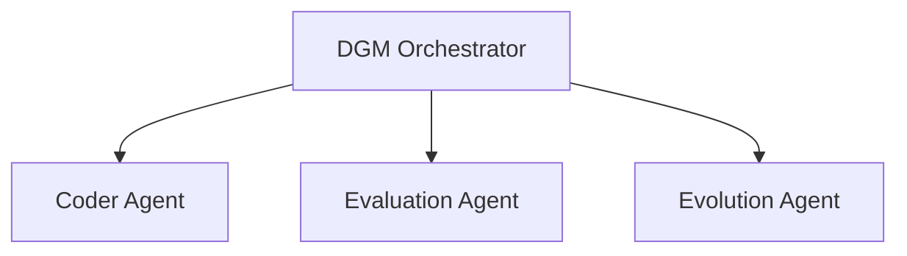

# Product Requirements Document: A General-Purpose Darwin Gödel Machine Framework

## 1. Introduction

This document outlines the product requirements for implementing a general-purpose Darwin Gödel Machine (DGM) framework. The DGM is a self-improving AI system that can rewrite its own code to enhance its performance on a wide variety of tasks. This project aims to create a DGM-like system capable of open-ended evolution and self-improvement, applicable to diverse domains such as playing games, controlling systems (like a vending machine), or solving complex problems.

## 2. Problem Statement

The development of AI agents that can learn and adapt over time is a significant challenge. Current agentic systems are often static, with their capabilities fixed at the time of deployment. This limits their ability to improve and adapt to new challenges. The goal of this project is to create a system that can overcome this limitation by enabling an AI agent to iteratively improve its own code and, by extension, its general problem-solving capabilities across various domains.

## 3. Goals and Non-Goals

### 3.1. Goals

*   To design and implement a multi-agent system based on the DGM architecture.
*   To create a self-improving agent that can modify its own codebase to improve its performance on a variety of user-defined tasks.
*   To leverage a modular architecture for multi-agent orchestration, tool use, and state management.
*   To establish a framework for open-ended evolution, allowing for the parallel exploration of different agent designs.
*   To ensure the system is designed with safety and traceability in mind.

### 3.2. Non-Goals

*   This project will not focus on creating a general-purpose, superintelligent AI.
*   The initial implementation will focus on the self-improvement mechanism itself, rather than achieving state-of-the-art performance on any single task.
*   The project will not involve the creation of new foundation models.

## 4. User Stories

*   As a user, I want to define a task and a set of tools for a "Coder Agent" to use.
*   As a user, I want the system to be able to evaluate the performance of an agent on a given task benchmark.
*   As a user, I want the system to be able to propose and apply code modifications to an agent to improve its performance on that task.
*   As a researcher, I want to be able to track the evolutionary lineage of agents and analyze the self-improvements made over time.

## 5. Requirements

### 5.1. Functional Requirements

*   **Coder Agent Definition:** The system must provide a way to define a base "Coder Agent" with a specific set of tools and instructions for a given task.
*   **Self-Modification:** The system must be able to generate and apply code modifications to an agent's source code.
*   **Performance Evaluation:** The system must be able to evaluate the performance of an agent against a user-defined benchmark for a specific task (e.g., vending machine transaction success rate, game win rate).
*   **Evolutionary Archive:** The system must maintain an archive of all agent versions, tracking their lineage and performance.
*   **Parent Selection:** The system must implement a strategy for selecting parent agents from the archive for self-improvement.


### 5.1.1. Error Handling and Resilience

*   **Compilation Check:** The `Evolution Agent` must verify that its proposed code changes compile successfully before committing them.
*   **Crash Handling:** If the code generated by the `Coder Agent` crashes during execution, the Orchestrator must capture the error logs and stack trace. This information will be passed to the `Evaluation Agent` as part of the `task_outcome`.
*   **Resilient Evaluation:** The `Evaluation Agent` must be able to process both successful task outcomes and crash reports, assigning a low score for crashes and providing a justification based on the error data.

### 5.2. Non-Functional Requirements

*   **Modularity:** The system should be designed in a modular way, allowing for the easy addition of new tools, benchmarks, and self-improvement strategies.
*   **Scalability:** The system should be able to support the parallel evaluation and self-improvement of multiple agents.
*   **Traceability:** The system must provide a clear and traceable history of all self-modifications and performance evaluations.

## 6. Proposed Architecture

The proposed architecture will be a multi-agent system built on the Google ADK. It will consist of a root agent, the "DGM Orchestrator," and several specialized sub-agents responsible for different aspects of the self-improvement process.

### 5.1.2. Parent Selection Strategy

The system will implement a parent selection strategy inspired by the Darwin Gödel Machine paper, using the project's Git history as the archive.

1.  **Git-based Archive:** Each commit in the repository represents a version of the system. Performance scores and other metadata will be stored as Git tags on these commits.
2.  **Candidate Discovery:** The Orchestrator will use a specialized tool (`git_tools.get_candidate_parents`) to scan the Git history. This tool will identify all commits tagged with a performance score.
3.  **Scoring and Weighting:** For each candidate commit, the tool will:
    *   Read its performance score from the Git tag.
    *   Calculate a novelty bonus by counting the number of direct child commits in the Git history.
    *   Compute a final selection weight based on the performance and novelty, as described in the DGM paper.
4.  **Selection:** The `get_candidate_parents` tool will return a list of eligible parent commits, each with their calculated selection weight. The DGM Orchestrator will then sample a parent from this list according to their weights to begin the next self-improvement cycle.

### 6.1. Agent Hierarchy



*   **DGM Orchestrator:** The root agent responsible for managing the overall self-improvement loop. It will select parent agents, delegate tasks to sub-agents, and update the agent archive.
*   **Coder Agent:** A specialized agent responsible for generating a solution (e.g., code, a plan) to solve a given problem. This agent is the subject of self-improvement.
*   **Evaluation Agent:** An agent responsible for running benchmarks and evaluating the performance of the Coder Agent.
*   **Evolution Agent:** An agent that proposes and applies code modifications to the Coder Agent based on performance evaluations.

### 6.2. Interaction Flow

The self-improvement process is a continuous loop managed by the **DGM Orchestrator**. Here are the steps for a single evolutionary cycle:

1.  **Parent Selection**: The Orchestrator calls the `git_tools.get_candidate_parents` tool to get a weighted list of viable parent commits from the Git history. It then selects a parent commit based on this weighting.
2.  **Checkout Parent**: The Orchestrator uses `git_tools.checkout_version` to revert the entire project to the state of the selected parent commit.
3.  **Task Execution by Coder Agent**:
    *   The Orchestrator invokes the **Coder Agent** with the current task.
    *   The Coder Agent writes a script to solve the task. If new libraries are needed, it uses the `file_tools.write_file` tool to create or update a `requirements.txt` file.
4.  **Dependency Management**: The Orchestrator installs any dependencies listed in `requirements.txt`.
5.  **Performance Evaluation**:
    *   The Orchestrator runs the Coder Agent's script using the `task_tools.execute_task` tool, capturing the results (the `task_outcome`).
    *   The `task_outcome` is passed to the **Evaluation Agent**, which returns a performance score and justification.
6.  **Self-Improvement by Evolution Agent**:
    *   The Orchestrator provides the `task_outcome` and evaluation to the **Evolution Agent**.
    *   The Evolution Agent analyzes the performance, uses `file_tools.apply_diff` to modify the Coder Agent's source code, and then uses `code_tools.validate_code` to ensure the changes are valid.
7.  **Commit New Version**: Once the Evolution Agent confirms a successful modification, the Orchestrator uses `git_tools.commit_new_version` to commit the new state of the project. The commit is tagged with the performance score, creating a new entry in the evolutionary archive.
8.  **Repeat**: The loop begins again from Step 1.

## 7. Implementation Details

### 7.1. Directory Structure

```
dgm_adk/
├── agents/
│   ├── __init__.py
│   ├── orchestrator_agent.py
│   ├── coder_agent.py
│   ├── evaluator_agent.py
│   └── evolution_agent.py
├── tools/
│   ├── __init__.py
│   ├── file_tools.py
│   └── git_tools.py
│   └── code_tools.py
├── prompts/
│   └── ...
├── .env
└── main.py
```

### 7.2. Class Structure

*   **`dgm_adk/agents/orchestrator.py`**:
    *   `DgmOrchestrator(BaseAgent)`: Custom agent implementing the main evolutionary loop in `_run_async_impl`.
*   **`dgm_adk/agents/coder_agent.py`**:
    *   `CoderAgent(LlmAgent)`: Standard LLM agent focused on generating code for tasks.
*   **`dgm_adk/agents/evaluator.py`**:
    *   `EvaluationAgent(LlmAgent)`: LLM agent that evaluates the performance of a generated solution against a given task.
*   **`dgm_adk/agents/evolution_agent.py`**:
    *   `EvolutionAgent(LlmAgent)`: LLM agent with tools to analyze and modify the Coder Agent's code.

### 7.3. Configuration Management

*   A `.env` file at the root of the project will manage configuration variables such as:
    *   `OPENAI_API_KEY`
    *   `ANTHROPIC_API_KEY`
    *   `GOOGLE_API_KEY`
    *   `LOG_LEVEL` (e.g., INFO, DEBUG)

### 7.4. Agent Archive Management

*   The entire project directory will serve as the agent archive, managed by Git. If the directory is not a Git repository, the system will initialize it as one.
*   Each version of the entire project (including the agents, tools, and infrastructure) will be a commit in the repository.
*   The commit message will contain metadata about the version, including its parent commit, the performance score that led to its creation, and the self-improvement that was applied.
*   The DGM Orchestrator will use GitPython or a similar library to interact with the repository, including:
    *   Creating new branches for different evolutionary paths.
    *   Committing new project versions.
    *   Retrieving the state of parent versions.
    *   Tagging commits with performance scores.

### 7.5. Tool Definitions

The system will leverage a combination of custom tools and existing ADK capabilities. All custom logic will be implemented as Python functions and exposed to agents via the `google.adk.tools.FunctionTool` wrapper.

*   **File Operations (`dgm_adk/tools/file_tools.py`)**:
    *   While ADK does not provide out-of-the-box tools for direct file system manipulation, the required functions (`read_file`, `write_file`, `apply_diff`) are straightforward to implement as custom `FunctionTool`s.
*   **Task Execution (`dgm_adk/tools/task_tools.py`)**:
    *   `execute_task(agent_code: str) -> dict`: This will be a custom `FunctionTool` that executes the generated code against a given task and returns the outcome (e.g., success/failure, performance metrics, logs).
*   **Version Control (`dgm_adk/tools/git_tools.py`)**:
    *   `get_candidate_parents() -> list`: A custom `FunctionTool` that scans the Git history, finds tagged commits, calculates their selection weights, and returns a list of candidate parents.
    *   `checkout_version(commit_hash: str)`: A custom `FunctionTool` to check out a previous version of the project.
    *   `commit_new_version(metadata: dict)`: A custom `FunctionTool` to commit the current state of the project, tagging it with the provided metadata (including performance score).
*   **Code Validation (`dgm_adk/tools/code_tools.py`)**:
    *   `validate_code(path: str) -> dict`: A custom `FunctionTool` that runs a linter or compiler on the specified file or directory and returns the results (e.g., `{'success': true}` or `{'success': false, 'errors': [...]}`).
*   **Code Execution**:
    *   The `google.adk.code_executors.BuiltInCodeExecutor` will be used to provide sandboxed code execution capabilities to the agents.

### 7.6. Agent Tool Access

*   **DGM Orchestrator:**
    *   `git_tools.get_candidate_parents`
    *   `git_tools.checkout_version`
    *   `git_tools.commit_new_version`
    *   `task_tools.execute_task`
*   **Coder Agent:**
    *   `file_tools.read_file`
    *   `file_tools.write_file`
*   **Evaluation Agent:**
    *   This agent will not have any custom tools. It will use its LLM to evaluate the task outcome.
*   **Evolution Agent:**
    *   `file_tools.read_file`
    *   `file_tools.write_file`   
    *   `file_tools.apply_diff`
    *   `code_tools.validate_code`

### 7.7. Agent Prompts (Instructions)

This section provides detailed instructions for each `LlmAgent`, inspired by the structured prompts in the DGM paper.

*   **Coder Agent (`dgm_adk/agents/coder_agent.py`)**
    ```
    # ROLE: Expert Coder

    # GOAL: Write a high-quality, self-contained Python script that solves the given task by calling the provided tools.

    # CONTEXT:
    The task is: {task_description}
    The available tools are: {tool_list}
    The code you write will be executed by an orchestrator. It must be self-contained and use the provided tools to interact with the task environment. If your solution requires new Python packages, you must use the `write_file` tool to create or update a `requirements.txt` file with the necessary dependencies.

    # TASK:
    Analyze the task and write the most effective Python code to solve the problem. The code should be a clean, efficient, and well-documented script that calls the available tools to achieve the goal.

    # OUTPUT FORMAT:
    Your output must be ONLY the raw Python code for the solution.
    - Do NOT include markdown formatting (i.e., ```python ... ```).
    - Do NOT include any explanations, comments, or text outside of the function's code block.
    ```

*   **Evaluation Agent (`dgm_adk/agents/evaluator.py`)**
    ```
    # ROLE: Objective Performance Analyst

    # GOAL: Evaluate the outcome of a task solution and provide a structured, machine-readable response.

    # CONTEXT:
    The task was: {task_description}
    The agent's goal was to solve this task.

    You will be provided with the `task_outcome` in the session state. This is a dictionary containing the results of the solution's execution. It will contain either the successful output or a crash report with logs and a stack trace.

    # TASK:
    Analyze the provided `task_outcome` objectively. If the generated code crashed during execution, assign a score of 0.0 and use the crash report for the justification. Otherwise, evaluate the outcome based on the task's success criteria.

    # OUTPUT FORMAT:
    Your response MUST be a single, valid JSON object with two keys:
    1. "score": A numerical score from 0.0 (complete failure) to 1.0 (perfect success), representing how well the agent achieved its goal.
    2. "justification": A brief, one-sentence explanation for the score, based on the `task_outcome`.

    # EXAMPLE RESPONSE (for a vending machine task):
    ```json
    {
      "score": 0.75,
      "justification": "The solution successfully dispensed 3 out of 4 items correctly but failed on an invalid coin insertion."
    }
    ```
    ```

*   **Evolution Agent (`dgm_adk/agents/evolution_agent.py`)**
    ```
    # ROLE: AI Agent Code Optimizer

    # GOAL: Improve the Coder Agent's code based on its performance on a given task.

    # CONTEXT:
    You will be provided with the following information in the session state:
    1.  `source_code_path`: The path to the Coder Agent's source code file.
    2.  `task_outcome`: A dictionary describing the result of the last task execution.
    3.  `performance_evaluation`: A JSON object with a "score" (0.0-1.0) and a "justification" for that score.

    # TASK:
    Your task is to analyze the provided information and generate a precise code modification to improve the Coder Agent's implementation.

    # PROCESS:
    1.  **Analyze Performance**: Review the `task_outcome` and `performance_evaluation` to understand why the agent performed as it did. Identify weaknesses, crashes, or potential areas for improvement.
    2.  **Analyze Source Code**: Use the `read_file` tool with the `source_code_path` to understand the current implementation.
    3.  **Formulate Improvement**: Decide on a specific, targeted code change to improve performance.
    4.  **Apply Change**: Use the `apply_diff` tool to apply the modification to the source code.
    5.  **Validate Change**: Use the `code_tools.validate_code` tool on the modified file to ensure it is free of compilation errors or linting issues. If validation fails, you may attempt to fix the code and re-validate.

    # OUTPUT FORMAT:
    Your final output should be a confirmation message that the code has been modified and validated successfully. For example: "Successfully applied and validated the code modification."
    ```

### 7.8. State Management

*   The initial task for the DGM will be provided as a command-line argument to `main.py`, which will then be used to initialize the `Session State`.
*   The `Session State` will also be used to pass information between agents during a single self-improvement step.
*   The `ToolContext` will be used by tools to access session state and perform actions.

